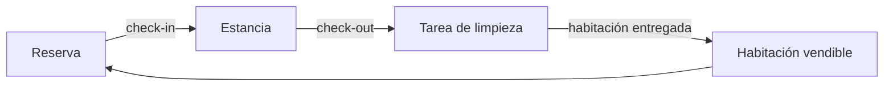
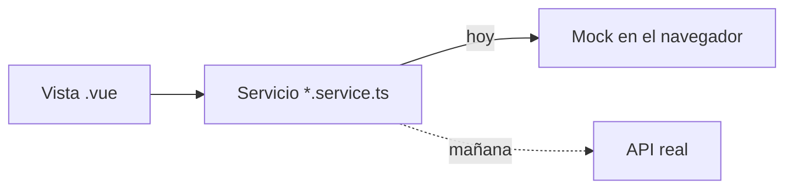

# KM.Hotel · Alba

[](https://github.com/Kreyshin/KM.WEB.HOTEL/actions/workflows/pages.yml)

Back office para hotelería y hospedaje: habitaciones, reservas, recepción, housekeeping, mantenimiento, tarifas por temporada y comprobantes. **Un sistema Karma Systems.**

| | |
| --- | --- |
| 📚 **Documentación** | [kreyshin.github.io/KM.WEB.HOTEL](https://kreyshin.github.io/KM.WEB.HOTEL/) |
| 🖥️ **Demo** | [kreyshin.github.io/KM.WEB.HOTEL/demo](https://kreyshin.github.io/KM.WEB.HOTEL/demo/) |

> La documentación es **funcional**, no técnica: explica el vocabulario, las pantallas y los procesos del hotel. Para el detalle de arquitectura, el código manda.

> En la demo el acceso viene precargado y acepta cualquier contraseña. Los datos viven en tu navegador y se reinician desde **Perfil → Datos de ejemplo**.

## El ciclo de la vertical

Donde Restaurante tiene **mesa → comanda → KDS**, Hospedaje tiene **habitación → reserva → estancia**, con housekeeping cerrando el circuito:



La decisión de diseño que gobierna todo el modelo: **una habitación tiene dos estados vivos e independientes**.

| Eje | Quién lo mueve | Valores |
| --- | --- | --- |
| **Ocupación** | Recepción | libre · ocupada · reservada · bloqueada |
| **Limpieza** | Housekeeping | limpia · sucia · en limpieza · por inspeccionar · fuera de servicio |

Una habitación puede estar **libre y sucia** (salió el huésped, aún no se repasa) u **ocupada y limpia**. Colapsarlos en un solo campo es el error clásico del dominio; aquí se evita por tipos.

## Enfoque: front primero

El back office se construye completo **sobre datos de ejemplo**, antes que el backend. La regla que lo hace posible:



- Las vistas **nunca** leen datos directamente: siempre llaman a un servicio.
- Cambiar el mock por la API solo toca el servicio; las vistas no cambian.
- Los tipos de `src/types` son el borrador del **modelo de datos** del backend.

## Stack

Vue 3 + TypeScript · Vite · Pinia · Vue Router · Tailwind CSS v4 · Vitest · Testing Library

## Empezar

Requisitos: **Node 24** o superior.

```bash
cd backoffice
npm install
npm run dev        # app en http://localhost:5173
npm run docs:dev   # documentación en local
```

| Script | Qué hace |
| --- | --- |
| `npm run dev` | Servidor de desarrollo |
| `npm run verify` | Formato, lint, tipos y pruebas. **Debe pasar antes de cada commit** |
| `npm run build` | Build de producción |
| `npm run build:demo` | Build de la demo para GitHub Pages |
| `npm run docs:build` | Build de la documentación |

### Cuentas de prueba

| Correo | Rol | Qué ve |
| --- | --- | --- |
| `admin@albahoteles.pe` | Administrador | Todo |
| `ana@albahoteles.pe` | Recepción | Tablero, reservas, huéspedes, facturación |
| `rosa@albahoteles.pe` | Gobernanta | Tablero, housekeeping, inventario de piso |
| `julio@albahoteles.pe` | Mantenimiento | Tablero e incidencias |

## Estructura

```text
.
├─ .github/workflows/pages.yml   Publica documentación y demo en GitHub Pages
└─ backoffice/
   ├─ docs/                      Documentación funcional (VitePress)
   └─ src/
      ├─ assets/                 Sistema de diseño (main.css) e identidad Karma
      ├─ components/
      │  ├─ layout/              Shell: barra de módulos, menú de secciones, cabecera
      │  ├─ marca/               Isotipos: Alba (vertical) y Karma Novum (plataforma)
      │  └─ ui/                  Kit Km*: tabla, catálogo, drawer, campos, estados
      ├─ composables/            useListado (tabla paginada), useConfirmarEstado
      ├─ config/marca.ts         Nombre, lema y capacidades de la vertical
      ├─ layouts/AppLayout.vue   Dos barras laterales + área de trabajo
      ├─ router/                 Rutas con guardas por rol
      ├─ services/               Un servicio por dominio + motor mock
      ├─ stores/                 auth, sede activa y UI (tema, toasts, menús)
      ├─ types/                  Modelo de dominio y tipos de UI
      ├─ utils/                  Formato, fechas, validaciones, mapas de estado
      └─ views/                  Una carpeta por módulo de navegación
```

## Identidad visual

Misma **estructura** que el resto de verticales Karma —barra de módulos de 92 px, menú de secciones flotante de 300 px, área de trabajo— y **voz propia**:

| | Restaurante | Hotelería |
| --- | --- | --- |
| Paleta | Naranja fuego, grafito, plata | Turquesa → azul, plata, negro azulado |
| Tipografía | Fraunces + Inter | Fraunces + Inter (compartida) |
| Radios | 8 / 14 / 20 px | 12 / 20 / 28 px |
| Portada | Rejilla de indicadores del servicio | Franja de jornada: llegadas, salidas y pisos |
| Isotipo | Llama | Techo y cama, del activo de marca |

Los tokens viven en `src/assets/main.css` con el prefijo `--hs-*` y se exponen a Tailwind por `@theme inline`. La identidad de plataforma Karma se conserva íntegra en `src/assets/karma/` y sigue apareciendo como atribución.

### Postura

El tamaño de los controles no es una constante del kit: lo pone la postura desde la que se usa cada pantalla. Las pantallas de operación llevan la clase de postura de su vertical y el kit lee la escala (`--km-toque`, `--km-texto`, `--km-fila`, `--km-celda`); el resto del back office no cambia, porque quien configura catálogos está sentado en la oficina en las tres. No es «todo más grande»: Hospedaje **aprieta**, porque en un mostrador ver una noche más vale más que un botón más gordo.

## Estado

| Módulo | Estado |
| --- | --- |
| Inicio · El día de hoy | ✅ |
| Tablero de habitaciones en vivo | ✅ |
| Habitaciones, plano por piso, tipos y pisos | ✅ |
| Reservas, recepción (check-in/out) y huéspedes | ✅ |
| Housekeeping e incidencias de mantenimiento | ✅ |
| Amenities, lencería y movimientos | ✅ |
| Rejilla de tarifas y temporadas | ✅ |
| Usuarios, roles y sedes | ✅ |
| Canales y OTA, reportes, facturación SUNAT, bitácora, motivos | 🚧 Ruta y permisos listos, vista pendiente |
